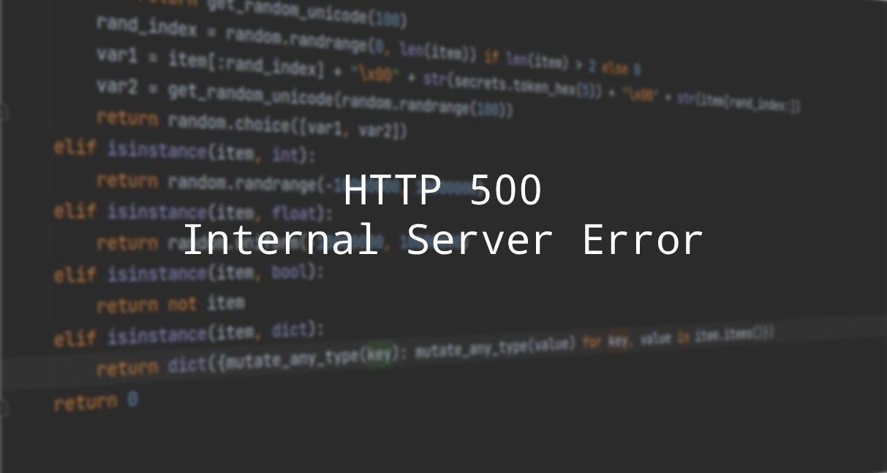

# POST JSON Fuzzer

## Table of Contents

0. [Description](#Description)
1. [Who is this fuzzer for](#Who-is-this-fuzzer-for)
2. [What this fuzzer is not](#What-this-fuzzer-is-not)
3. [POST JSON fuzzer basic cases](#POST-JSON-fuzzer-basic-cases)
4. [More complex cases using DSL](#More-complex-cases-using-DSL)
	1. [Reverse Polish notation](#Reverse-Polish-notation)
	2. [DSL](#DSL)
	3. [Make it all together](#Make-it-all-together)
5. [Tips and tricks](#Tips-and-tricks)
5. [Requirements](#Requirements)
6. [Building and Running in Docker](#Building-and-Running-in-Docker)
7. [Tests](#Tests)
8. [CLI Interface](#CLI-Interface)
9. [Restrictions](#Restrictions)
10. [TODO](#TODO)

## Description
POST JSON Fuzzer: "Your API could have been in his place"
<p align="center">
  
</p>
POST JSON Fuzzer is a lightweight WEB fuzzer for API validation. It tries to find as many unexpected responses from the service as possible.
POST JSON Fuzzer makes API check for critical bugs, and you can define test scripts yourself in a clear and concise way, using a small Domain-specific language. The DSL code will be embedded directly into the JSON body of the request. Each test suite will thus be concise and declarative. It will be obvious which parameters are being tested, and how. Write your own data generators, mutators, datasets - it won't be hard!

## Who is this fuzzer for
POST JSON Fuzzer is suitable in everyday work:
* for a developer who needs API checks for the slightest changes in the code (for example, 2K checks in ~ 2 minutes). Unit tests have already been written, but additional system or integration testing is needed
* for a QA engineer or a test engineer to automate those API checks that are done by hand. At the same time, solutions like Postman or Burp Suite are not suitable, or they don’t like it (with all due respect to these wonderful products), or their functionality is redundant for urgent tasks. At the same time, I would like to see a declarative description of the test suite in a concise form
* if you have your own opinion on how to test the API, and do not want to use fuzzers, which are more complicated and may not find the right issue. You want to write your own scripts (strategies) for each JSON parameter (sets, mutations, random data in the right places, etc.)
* if you need somke tests in the pipeline
* if you need an additional fuzzer that is easier to adjust for spot checks

## What this fuzzer is not
POST JSON Fuzzer does not look for vulnerabilities, but tries to break the service and show under what conditions it turned out to be possible.

## POST JSON fuzzer workflow
Let's say you have a service with an API that expects a body with a JSON document of the following structure in the incoming POST request:
```
{
	"id": 31,
	"title": "Buy some stuff",
	"price": 109.95,
	"category": "gadgets",
	"description": "Cool watches"
}
```
How to find the maximum set of parameter combinations that will lead to unexpected errors in your service? A similar class of problems is solved by fuzzers. There are a lot of fuzzers. Some of them are able to parse the Open API specification by parsing the swagger file. After the analysis, the fuzzer is able to check the compliance with the specification and the real API.

But what if you want to do basic checks on the most frequent cases? Change the id in the range from 1 to 100K, or try to put a number instead of a string in the value of the title field. Change the price value from 109 dollars to two cents, etc. These are routine checks that are sometimes still done manually, oh horror! 
This phaser suggests using a special small DSL that will generate as many variants of JSON bodies for your POST request as you need, based on your own work cases. At the same time, our goal is to get as many unexpected responses from the service as possible (500, 400, 404, etc.)

Let's check the above id, price and title fields, for example:
- let id change in the range -1 to 100K (as indicated above). We also try to set another name, e.g. `"client_id"` 
- we will make the price zero, in the value of two cents, a negative number, and very large. We will also add some garbage data
- just try to change the title to a number, make it longer, shorter, and an empty string

Create a test_api.py file with the following content:
```
{
	("id", "client_id"): (31, -1, 0, 1, 1000, 100000, 100001),
	"title": (1, "Buy some stuff", "Buy", ""),
	"price": (109.95, 0, -1, 0.01, 127387126928357098597264823687398345093485893278573648572683746187641876, "Îäíàæäû"),
	"category": "gadgets",
	"description": "Cool watches"
}
```
This file will be read by the fuzzer using the eval method, and will be converted to a typical dict. After that, the fuzzer will begin its analysis and processing.

The key point here is that you, as a fuzzer user:
1. Create a JSON-like structure that you understand. There is no need to describe each parameter in an unreadable way, as in other fuzzers. Everything is familiar and obvious.
2. In this structure, you use a DSL whose code is inside tuple-like structures. In fact, this is a tuple from python. And JSON has no analogue of tuple, so we can freely use it and not be afraid of anything.
3. The fuzzer will cut each such tuple-like structure from the test_api.py file, parse them, and at the final stage create all possible combinations of parameters for JSON. After that, each created combination will be inserted into its own JSON structure, which will no longer have any tuples. 
An example of a structure from a similar set:
```
{
	"id": -1,
	"title": "Buy",
	"price": 109.95,
	"category": "gadgets",
	"description": "Cool watches"
}
```
After that, the fuzzer will start sending all created json bodies one by one(asynchronously) via POST request to the URL that you specify in the fuzzer launch parameters (see below, there is also information about authentication tokens).
The results are printed to the console and also saved to a csv file.
An example of console output:
```
current request with {'id': -1, 'title':'Buy', 'price': 109.95, ... } parameters results 500: Server Error
```
## More-complex-cases-using-DSL
Well, we are good fellows, and we checked the most basic options. But these are all very simple cases. How about making something more difficult?
We have a small DSL in our arsenal. Here are its capabilities:
* Create your own data generators (random, mutated, deterministic). Each element created by the generator can take any value of any type
* A combination of your data options (described in order in a tuple) along with those created by the generator
* The ability to mutate the value of any parameter using third-party mutators (for example, [Radamsa](https://pypi.org/project/pyradamsa/)) or mutators written by you

Everything you need to know to successfully use this DSL:
1) be able to use [reverse Polish notation](https://en.wikipedia.org/wiki/Reverse_Polish_notation)
2) several syntactic constructions
#### Reverse Polish notation
The simplest example from wikipedia is `3 4 +`. Here we push the numbers 3 and 4 onto the stack. As soon as we meet the sign of the operation (in this case, addition), we pop two values from the stack, and apply the addition operation to them, after which we again put the result on the stack.

We will do the same with our parameters in a tuple:
An entry of the form `"id": (-1, 2, '+')` will mean - put the number -1 on the stack, then put the number 2. Then take both numbers from the stack, Apply the '+' operation to them, and then put the result on the stack. Important - the stack is organized as a python list.

#### DSL
The main task of the DSL is to create a set of options with different values for each parameter of interest in our json document in the form of a python list.</br>
For example, having the entry `"id": (31, -1, 0, 1, 1000, 100000, 100001)` the final list will be `[100001, 100000, 1000, 1, 0, -1, 31]`.

After all the lists have been created for each required parameter, the json post fuzzer will form all possible combinations from them, and create the final list of json structures that will be sent to your service.</br>
If in our document we will check only two parameters -
`"id": (31, -1),
"title": (1, "Buy"),`
then the fuzzer will create two lists `[-1, 31]` and `["Buy", 1]` and then four combinations based on them. And finally, the fuzzer will create a list of four final json structures, each of which will contain both mutable parameters (for example, `"id"`), and those that have not changed (for example, the `"category"` field).

To create more complex sets of parameters and their combinations, the DSL uses several operators:
- **'@'** - operation of removing a leaf from the stack (`stack.pop()`). This operation should be used in cases where you have formed the resulting leaf lying on the top of the stack, and now you need to get it.<br />
Example:
`("1", [4, 5, 6], '+', '@')`. Since this will be adding `"1"` to the already existing sheet, the stack will end up with the sheet `[['4', '5', '6', '1']]`, and the `@` operation will help get it - `['4', '5', '6', '1']`.

- **'#'** - separator used by the STRATEGY and FUNC statements. It is always needed when you want to apply a function, before that you have specified its name and a set of parameters.<br />
Example:
`(1, '#FUNC#LIST_IT#list_several_times#2$')`. The FUNC operator of the `LIST_IT` category of the list_several_times function, which takes the number of operations as input, will be applied to element 1.

- **'$'** - termination character. Used for `STRATEGY` and `FUNC`, each must end with this character.<br />
Examples:
`('#STRATEGY#digits$', '@')`, `(1, '#FUNC#LIST_IT#list_once$')`

- **STRATEGY** - adding a sheet with a strategy to the stack. A strategy is a ready-made list of elements that will be substituted into your json parameter. The built-in basic strategy will add contains different numbers, strings, characters, boolean values and the `None`(`null` in json) command. <br />
Example: if we have a strategy `bls = [True, False]`, then `((0, '#STRATEGY#bls$', '+', '@')` will give us the option `[True, False, 0]`.

- **FUNC** is an operator to apply some action to the top element on the stack. (Write about registering functions and lambdas)<br />
Example: `(1, '#FUNC#LIST_IT#list_once$')` will result in `[[1]]`<br />
Another example: `(1, '#FUNC#LIST_IT#list_several_times#2$')` would give `[[[1]]]`

- **MUTATE_IT** - mutate the top element on the stack. If a result list is at the top of the stack, all of its elements will be mutated. Otherwise, one element will be mutated.  <br />
Example: if there is `([1, 2, 3], '#FUNC#MUTATE_IT#nullify_all_elements$', '@')`, then the result will be `[0, 0, 0]`.

That's all, nothing complicated. More examples of the use of various options can be found in the [tests](https://github.com/vzhirnov/post_json_fuzzer/tree/master/tests).

#### Make it all together
Let's now get significantly more options for testing our API than in the first example.
Take a look at this:
```
{
	("id", "id", '#FUNC#MUTATE_IT#mutate_element_by_radamsa$', '+', '@'): (31, '#STRATEGY#basic$', '+', '@'),
	"title": ("Buy some stuff", "'\xf3"),
	"price": (109.95, '#STRATEGY#basic$', '+', '#STRATEGY#basic$', '#FUNC#MUTATE_IT#mutate_all_elements_by_radamsa$', '+', '@'),
	"category": "gadgets",
	"description": "Cool watches"
}
```
Here is what we get as a result:
1. Keyname `"id"` will get two variants - the `"id"` itself, and muteted one, say `"id\x00"`. <br />It's value will be a list like `\["some str", "another str", ... , 31\]`
2. "title" will have only two values. Obvious.
3. "price" - `[_list items from basic strategy_, 109.95\, _muteted list items from basic strategy_]`
All other fields will remain unchanged. 

That's all. In any difficult situation, look at [tests](https://github.com/vzhirnov/post_json_fuzzer/blob/master/tests/test_generate_strategy.py), they have enough options for any of your fantasies (if not, please send me an MP with additions).


## Tips and tricks
WIP<br />
Missing parameter value<br />
Duplicate parameter value

## Requirements
* aiohttp~=3.8.1
* asyncio~=3.4.3
* pytest~=7.1.1

## Building and Running in Docker
```bash
docker build --tag post_json_fuzzer:0.0.1 .
docker run -v /tmp/cartridges:/cartridges -v /tmp/results:/results --rm --name post_json_fuzzer.container post_json_fuzzer:0.0.1 -url="https://YOUR_ENDPOINT" -H "X-HEADER-UUID=HEADER-UUID" "X-API-Secret=API-Secret" -file "cartridges/json_tests_dsl_description.txt"
```
## Tests
To run basic tests go to tests/ dir and run:
```bash
pytest .
```
## CLI Interface
```bash
usage: post_json_fuzzer.py [-h] -url URL -file FILE
                           [--headers [HEADERS [HEADERS ...]]]
```
## Restrictions
Works with secret token only, there is no other authentication scenarios yet

## TODO
WIP</br>
